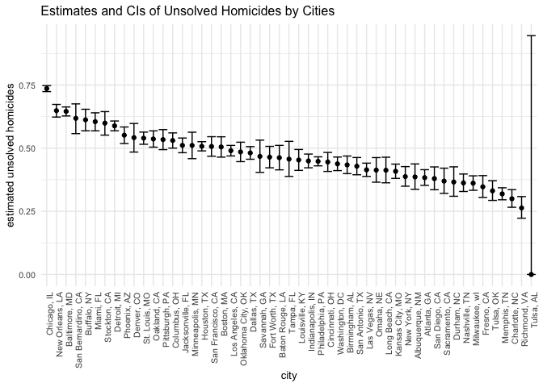

p8105_hw5_jm5509
================
Echo
2022-11-05

## Problem 2

Then I created a city_state variable.

``` r
homicides_df <- read.csv("https://raw.githubusercontent.com/washingtonpost/data-homicides/master/homicide-data.csv")

homicides_df <-  homicides_df %>% 
  mutate(city_state = str_c(city, state, sep = ', ')) 
```

I summarize within cities to obtain the total number of homicides.

``` r
homicides_total <- 
  homicides_df %>% 
  group_by(city_state) %>% 
  summarize(n_total = n())
```

Then I summarize within cities, but this time to obtain **the number of
unsolved homicides** (those for which the disposition is “Closed without
arrest” or “Open/No arrest”).

``` r
homicides_unsolved <- 
  homicides_df %>% 
  filter(disposition == 'Closed without arrest' | 
           disposition == 'Open/No arrest') %>% 
  group_by(city_state) %>% 
  summarize(n_unsolved = n())
```

Then join the two data frames together:

``` r
homicides_table <- left_join(homicides_total, homicides_unsolved, by = 'city_state')
homicides_table[is.na(homicides_table)] <- 0
homicides_table %>% knitr::kable()
```

| city_state         | n_total | n_unsolved |
|:-------------------|--------:|-----------:|
| Albuquerque, NM    |     378 |        146 |
| Atlanta, GA        |     973 |        373 |
| Baltimore, MD      |    2827 |       1825 |
| Baton Rouge, LA    |     424 |        196 |
| Birmingham, AL     |     800 |        347 |
| Boston, MA         |     614 |        310 |
| Buffalo, NY        |     521 |        319 |
| Charlotte, NC      |     687 |        206 |
| Chicago, IL        |    5535 |       4073 |
| Cincinnati, OH     |     694 |        309 |
| Columbus, OH       |    1084 |        575 |
| Dallas, TX         |    1567 |        754 |
| Denver, CO         |     312 |        169 |
| Detroit, MI        |    2519 |       1482 |
| Durham, NC         |     276 |        101 |
| Fort Worth, TX     |     549 |        255 |
| Fresno, CA         |     487 |        169 |
| Houston, TX        |    2942 |       1493 |
| Indianapolis, IN   |    1322 |        594 |
| Jacksonville, FL   |    1168 |        597 |
| Kansas City, MO    |    1190 |        486 |
| Las Vegas, NV      |    1381 |        572 |
| Long Beach, CA     |     378 |        156 |
| Los Angeles, CA    |    2257 |       1106 |
| Louisville, KY     |     576 |        261 |
| Memphis, TN        |    1514 |        483 |
| Miami, FL          |     744 |        450 |
| Milwaukee, wI      |    1115 |        403 |
| Minneapolis, MN    |     366 |        187 |
| Nashville, TN      |     767 |        278 |
| New Orleans, LA    |    1434 |        930 |
| New York, NY       |     627 |        243 |
| Oakland, CA        |     947 |        508 |
| Oklahoma City, OK  |     672 |        326 |
| Omaha, NE          |     409 |        169 |
| Philadelphia, PA   |    3037 |       1360 |
| Phoenix, AZ        |     914 |        504 |
| Pittsburgh, PA     |     631 |        337 |
| Richmond, VA       |     429 |        113 |
| Sacramento, CA     |     376 |        139 |
| San Antonio, TX    |     833 |        357 |
| San Bernardino, CA |     275 |        170 |
| San Diego, CA      |     461 |        175 |
| San Francisco, CA  |     663 |        336 |
| Savannah, GA       |     246 |        115 |
| St. Louis, MO      |    1677 |        905 |
| Stockton, CA       |     444 |        266 |
| Tampa, FL          |     208 |         95 |
| Tulsa, AL          |       1 |          0 |
| Tulsa, OK          |     583 |        193 |
| Washington, DC     |    1345 |        589 |

For the city of Baltimore, MD, use the prop.test function to estimate
the proportion of homicides that are unsolved; save the output of
prop.test as an R object, apply the broom::tidy to this object and pull
the estimated proportion and confidence intervals from the resulting
tidy dataframe.

``` r
baltimore_df <- homicides_df %>% 
  filter(city_state == 'Baltimore, MD')

(baltimore_total <- baltimore_df %>% nrow())
```

    ## [1] 2827

``` r
(baltimore_unsolved <- baltimore_df %>% 
  filter(disposition == 'Closed without arrest' | 
           disposition == 'Open/No arrest') %>% 
  nrow())
```

    ## [1] 1825

``` r
baltimore_test <- prop.test(baltimore_unsolved, baltimore_total)

baltimore_test %>% broom::tidy() %>% 
  select(estimate, conf.low, conf.high) %>% 
  knitr::kable(digits = 3)
```

| estimate | conf.low | conf.high |
|---------:|---------:|----------:|
|    0.646 |    0.628 |     0.663 |

Then I run `prop.test` for each of the cities in your dataset, and
extract both the proportion of unsolved homicides and the confidence
interval for each. Do this within a “tidy” pipeline, making use of
`purrr::map`, `purrr::map2`, list columns and unnest as necessary to
create a tidy dataframe with estimated proportions and CIs for each
city.

``` r
homicides_stats <- 
  homicides_table %>% 
  mutate(prop_test = map2(n_unsolved, n_total, prop.test)) %>% 
  mutate(prop_test = map(prop_test, broom::tidy))%>% 
  unnest() %>% 
  select(city_state, estimate, conf.low, conf.high) 
```

    ## Warning in .f(.x[[i]], .y[[i]], ...): Chi-squared approximation may be incorrect

    ## Warning: `cols` is now required when using unnest().
    ## Please use `cols = c(prop_test)`

``` r
homicides_stats %>% knitr::kable(digits = 3)
```

| city_state         | estimate | conf.low | conf.high |
|:-------------------|---------:|---------:|----------:|
| Albuquerque, NM    |    0.386 |    0.337 |     0.438 |
| Atlanta, GA        |    0.383 |    0.353 |     0.415 |
| Baltimore, MD      |    0.646 |    0.628 |     0.663 |
| Baton Rouge, LA    |    0.462 |    0.414 |     0.511 |
| Birmingham, AL     |    0.434 |    0.399 |     0.469 |
| Boston, MA         |    0.505 |    0.465 |     0.545 |
| Buffalo, NY        |    0.612 |    0.569 |     0.654 |
| Charlotte, NC      |    0.300 |    0.266 |     0.336 |
| Chicago, IL        |    0.736 |    0.724 |     0.747 |
| Cincinnati, OH     |    0.445 |    0.408 |     0.483 |
| Columbus, OH       |    0.530 |    0.500 |     0.560 |
| Dallas, TX         |    0.481 |    0.456 |     0.506 |
| Denver, CO         |    0.542 |    0.485 |     0.598 |
| Detroit, MI        |    0.588 |    0.569 |     0.608 |
| Durham, NC         |    0.366 |    0.310 |     0.426 |
| Fort Worth, TX     |    0.464 |    0.422 |     0.507 |
| Fresno, CA         |    0.347 |    0.305 |     0.391 |
| Houston, TX        |    0.507 |    0.489 |     0.526 |
| Indianapolis, IN   |    0.449 |    0.422 |     0.477 |
| Jacksonville, FL   |    0.511 |    0.482 |     0.540 |
| Kansas City, MO    |    0.408 |    0.380 |     0.437 |
| Las Vegas, NV      |    0.414 |    0.388 |     0.441 |
| Long Beach, CA     |    0.413 |    0.363 |     0.464 |
| Los Angeles, CA    |    0.490 |    0.469 |     0.511 |
| Louisville, KY     |    0.453 |    0.412 |     0.495 |
| Memphis, TN        |    0.319 |    0.296 |     0.343 |
| Miami, FL          |    0.605 |    0.569 |     0.640 |
| Milwaukee, wI      |    0.361 |    0.333 |     0.391 |
| Minneapolis, MN    |    0.511 |    0.459 |     0.563 |
| Nashville, TN      |    0.362 |    0.329 |     0.398 |
| New Orleans, LA    |    0.649 |    0.623 |     0.673 |
| New York, NY       |    0.388 |    0.349 |     0.427 |
| Oakland, CA        |    0.536 |    0.504 |     0.569 |
| Oklahoma City, OK  |    0.485 |    0.447 |     0.524 |
| Omaha, NE          |    0.413 |    0.365 |     0.463 |
| Philadelphia, PA   |    0.448 |    0.430 |     0.466 |
| Phoenix, AZ        |    0.551 |    0.518 |     0.584 |
| Pittsburgh, PA     |    0.534 |    0.494 |     0.573 |
| Richmond, VA       |    0.263 |    0.223 |     0.308 |
| Sacramento, CA     |    0.370 |    0.321 |     0.421 |
| San Antonio, TX    |    0.429 |    0.395 |     0.463 |
| San Bernardino, CA |    0.618 |    0.558 |     0.675 |
| San Diego, CA      |    0.380 |    0.335 |     0.426 |
| San Francisco, CA  |    0.507 |    0.468 |     0.545 |
| Savannah, GA       |    0.467 |    0.404 |     0.532 |
| St. Louis, MO      |    0.540 |    0.515 |     0.564 |
| Stockton, CA       |    0.599 |    0.552 |     0.645 |
| Tampa, FL          |    0.457 |    0.388 |     0.527 |
| Tulsa, AL          |    0.000 |    0.000 |     0.945 |
| Tulsa, OK          |    0.331 |    0.293 |     0.371 |
| Washington, DC     |    0.438 |    0.411 |     0.465 |

Create a plot that shows the estimates and CIs for each city – check out
`geom_errorbar` for a way to add error bars based on the upper and lower
limits. Organize cities according to the proportion of unsolved
homicides.

``` r
homicides_stats %>% 
  mutate(city_state = fct_reorder(city_state, desc(estimate))) %>% 
  ggplot(aes(x = city_state, y = estimate)) +
  geom_point() +
  geom_errorbar(aes(ymin = conf.low, ymax = conf.high)) +
  theme(text = element_text(size = 10),
          axis.text.x = element_text(angle = 90, hjust = 1)) +
  labs(
    title = 'Estimates and CIs of Unsolved Homicides by Cities'
  )
```

<!-- -->

## Problem 3

First I write the function to set the simulation model: to perform
t-test for data simulated in normal distribution, and the output is the
estimate and the p-value.

``` r
sim_t_test <- function(n = 30, mu = 0, sigma = 5){
  sim_data = tibble(
    x = rnorm(n, mean = mu, sd = sigma),
  )
  
  sim_data %>% 
    t.test() %>% 
    broom::tidy() %>% 
    select(estimate, p.value)
}
```

Generate 5000 datasets from the model:

``` r
sim_results_df_1 = 
  expand_grid(
  sample_size = 30,
  iteration = 1:5000
) %>% 
  mutate(
    estimate_df = map(sample_size, sim_t_test)
  ) %>% 
  unnest(estimate_df)
```
